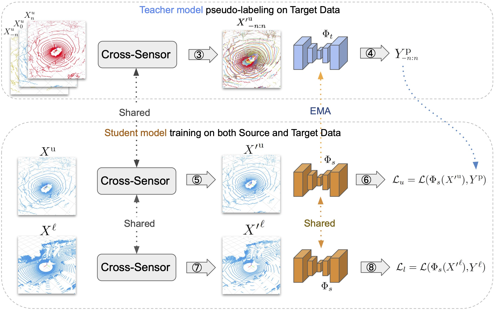

# `T-UDA` Temporal Unsupervised Domain Adaptation 3D Sequential Data

`T-UDA` The source code for the work **Temporal Unsupervised Domain Adaptation in Sequential Point Clouds**

Train a model in source domain (i.e., nuScences dataset), and then perform unsupervised domain adaptation to target
domain (i.e., Semantic-kitti data).

## Usage

### Prerequisites

The code is built with following libraries:

- Python >= 3.6, \<3.8
- [PyTorch](https://github.com/pytorch/pytorch) >= 1.6
- [tqdm](https://github.com/tqdm/tqdm)
- [torchpack](https://github.com/mit-han-lab/torchpack)
- [torchsparse](https://github.com/mit-han-lab/torchsparse)
- [numba](http://numba.pydata.org/)
- [cv2](https://github.com/opencv/opencv)

#### Recommended Installation

For easy installation, use [conda](https://docs.conda.io/projects/conda/en/latest/):

```
conda create -n tuda python=3.7
conda activate tuda
conda install pytorch torchvision torchaudio cudatoolkit=10.2 -c pytorch
conda install numba opencv
pip install torchpack
pip install --upgrade git+https://github.com/mit-han-lab/torchsparse.git
```

### Data Preparation

### Dataset (i.e. nuScenes/WOD/SemanticKitti)

Please create your dataset in the folder: "dataset", e.g:

```
dataset/nuscences/...
```

The structure of the dataset should look like the directory tree bellow. Please also check the sample file inside the "
dataset/nuScenes"

```
./	 
├── ...
└── dataset
    └── Datasetname 
         ├── seq1/    
         │   ├── lidar/	
         │   │	├── 000000.npy
         │   │	├── 000001.npy
         │   │	└── ...
         │   ├── labels/  # optional (only used for training/evaluation)
         │   │   ├── 000000.npy
         │   │   ├── 000001.npy
         │   │   └── ...
         │   └── poses/
         │       ├── 000000.npy
         │       ├── 000001.npy
         │       └── ... 
         └── ...
```

### Data preprocessing

Since the model requires inputs with the same lidar beam as npy file with information such as lidar, poses, and labels (
for training purpose)
please make sure to perfom lidar transfer form kitti to nuScene:

```
cd tools
python kitti_bin_2_nuscenes_npy.py
python label_mapping_npy.py
```

## Training

To train the model please prepare both source and target domain datasets (e. source: sematickitti, target: nuscences),
then run:

   ```
      python train_uda.py configs/data_config/da_kitti_nuscenes/uda_kitti_nuscenes.yaml --distributed False --ssl False
   ```

or

   ```
      cd scrptis/da_kitti_nuscenes
      sh train_nuscenes_kitti.sh
   ```

## Evaluation/Testing on Target domain

To evaluate the model performance,

1. make sure there are labels provided for the data
2. modify the configs/data_config/da_kitti_nuscenes/uda__nuscenes_itti.yaml with your custom settings. We provide a
   sample yaml for multi-frame (both past and future) aggregation
3. eval the network by running

   ```
      python evaluate_uda.py configs/data_config/da_kitti_nuscenes/uda_nuscenes_kitti.yaml --network Student

   ```
   or

   ```
      cd scrptis/da_kitti_nuscenes
      sh val_uda_nuscenes_kitti.sh   
   ```

### Pretrained Models

-- Pretrained model for nuscenes --> kitti found at

- ./weights/minkunet/....pt

## TODO List

- [x] Provided Eval/test code for all dataset.
- [x] Support Future-frame supervision semantic segmentation.
- [x] Support Unsupervised domain adaptation supervision semantic segmentation.
- [X] Support Knowledge Distillation on single-frame and multi-frame semantic segmentation.
- [X] Release data preparation code.
- [ ] Paper citation.

## Reference

Comming soon ...

## Acknowledgments

- This work was supported in part by OP VVV MEYS funded project CZ.02.1.01/0.0/0.0/16 019/0000765 “Research Center for
  Informatics”, and by Grant Agency of the CTU Prague under Project SGS22/111/OHK3/2T/13. Authors want to thank Valeo
  company for a support.
- We thank for the opensource codebase, [Cylinder3D](https://github.com/xinge008/Cylinder3D)
  and [spvnas](https://github.com/mit-han-lab/spvnas)